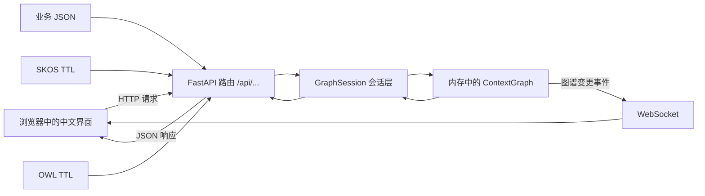

# 采购合规审查 Demo：每一步的输入、输出与源码解读

这份文档不按“平台术语”讲，而是按一个更简单的问题讲：

> 当我在页面上点一下按钮时，我给程序输入了什么？程序调用了哪段源码？它算出了什么？页面最终显示了什么？

本文与 [现场演示脚本](./采购合规审查演示脚本.md) 配套。建议先执行一次重置：

```bash
cd "/Users/tianqi/Documents/New project 2/semantica"
./demos/procurement-compliance/scripts/reset-and-load-demo.sh
```

然后打开 [http://127.0.0.1:8000/](http://127.0.0.1:8000/)。

演示中的企业、人员和数据均为虚构。

### 建议怎么读

如果你第一次接触 Semantica，不必从头到尾一次读完：

1. 先看第 1 节，分清“预置数据”和“现场计算”；
2. 再看第 20 节的一页式对照表，建立全局概念；
3. 实际操作 Demo 时，按第 5～16 节逐步看输入和输出；
4. 需要改造成自己的场景时，再看第 18～19 节的 Python 和配置示例。

整条业务主线其实只有一句话：

> 先把采购申请、供应商、员工、制度和证据装成一张图；再用搜索、路径、时间、规则和相似度去查询这张图；最后把新证据和推导结果继续写回图中。

---

## 1. 先说最容易误解的地方

这个 Demo 里有三类结果，必须分清。

| 类型 | 通俗解释 | 本 Demo 中的例子 |
| --- | --- | --- |
| 预先配置的数据 | 相当于已经从 ERP、SRM、制度库和审计系统采集好的资料 | “风险评分 92”“违反 4 条制度”“李明与供应商实控人存在亲属关系” |
| 运行时计算 | 点击按钮后，后端根据图谱或规则现场计算 | 搜索、最短路径、语义相似度、时间快照、规则推理、重复实体扫描 |
| 前端展示状态 | 只影响当前浏览器怎么显示，不改变后端图谱 | 聚焦视图、节点高亮、客户端注册表、中文翻译 |

所以，页面中的“92 分”不是这个 Demo 现场从 268 万元自动计算出来的。它已经作为决策节点的属性写在 JSON 中。

真正现场计算的是：

- 从决策到采购经办人的路径；
- 哪些节点与该决策的向量最相似；
- 某个日期哪些节点有效；
- 输入事实和规则后能推出什么新关系；
- 两条供应商记录是否像重复记录；
- SKOS 词表和 OWL 本体如何被解析成图谱结构。

这并不是缺点，而是 Demo 与生产系统的正常边界：生产环境中，“预先配置的数据”应由真实业务系统、规则引擎或数据管道产生。

---

## 2. 整体架构：浏览器、API 和图谱怎么配合



对应源码：

- 应用启动和路由注册：[app.py](../../semantica/explorer/app.py)
- 图谱会话层：[session.py](../../semantica/explorer/session.py)
- JSON/CSV 导入：[export_import.py](../../semantica/explorer/routes/export_import.py)
- 图谱查询：[graph.py](../../semantica/explorer/routes/graph.py)
- React 前端入口：[App.tsx](../../explorer/src/App.tsx)

### 当前 Docker 环境有一个重要事实

当前 Explorer 使用的是进程内存中的 `ContextGraph`。虽然 Docker Compose 同时启动了 FalkorDB，但 [app.py](../../semantica/explorer/app.py) 的注释明确说明：Explorer 当前还没有直接连接 FalkorDB。

因此：

- 重启 `explorer` 容器，当前图谱会清空；
- 重启 FalkorDB 并不能恢复 Explorer 图谱；
- Demo 才需要用重置脚本重新导入数据；
- 生产落地必须另外配置持久化图数据库或启动时自动装载数据。

本机端口只绑定在 `127.0.0.1`。相关配置在：

- [docker-compose.override.yml](../../docker-compose.override.yml)
- [Dockerfile.cpu](../../Dockerfile.cpu)

```yaml
SEMANTICA_ALLOW_ANONYMOUS: "true"
ports:
  - "127.0.0.1:8000:8000"
```

这表示本地 Demo 不要求 API Key，但不应直接暴露到局域网或互联网。

---

## 3. Demo 是怎么被装进去的

入口脚本是 [reset-and-load-demo.sh](./scripts/reset-and-load-demo.sh)。它做两件事：

1. 重启 Explorer，得到一张空的内存图谱；
2. 调用 [load-demo.sh](./scripts/load-demo.sh) 依次导入三份数据。

### 3.1 第一份输入：采购业务图谱 JSON

文件：[procurement-compliance-base.json](./data/procurement-compliance-base.json)

请求：

```http
POST /api/import
Content-Type: multipart/form-data
file=@procurement-compliance-base.json
```

预期输出：

```json
{
  "status": "success",
  "nodes_added": 36,
  "edges_added": 54,
  "nodes_imported": 36,
  "edges_imported": 54
}
```

后端入口是 [export_import.py](../../semantica/explorer/routes/export_import.py) 中的 `import_file()`：

1. 只接受 `.json` 或 `.csv`；
2. 文件最大 50 MB；
3. 从 `nodes` 和 `edges` 读取数据；
4. 把字段统一成 `GraphSession` 能识别的格式；
5. 调用 `session.add_nodes_and_edges(nodes, edges)` 写入图谱。

### 3.2 第二份输入：SKOS 业务词表

文件：[procurement-compliance-vocabulary.ttl](./data/procurement-compliance-vocabulary.ttl)

请求：

```http
POST /api/vocabulary/import
Content-Type: multipart/form-data
file=@procurement-compliance-vocabulary.ttl
```

预期输出摘要：

```json
{
  "status": "success",
  "nodes_added": 14,
  "edges_added": 29,
  "format": "turtle"
}
```

后端 [vocabulary.py](../../semantica/explorer/routes/vocabulary.py) 调用 [rdf_parser.py](../../semantica/explorer/utils/rdf_parser.py) 中的 `parse_skos_file()`：

- `skos:ConceptScheme` 变成词表方案节点；
- `skos:Concept` 变成概念节点；
- `skos:broader`、`skos:inScheme` 等变成关系；
- 后端检查层级关系，避免导入循环的 SKOS 上下级结构。

### 3.3 第三份输入：OWL 领域本体

文件：[procurement-compliance-ontology.ttl](./data/procurement-compliance-ontology.ttl)

`load-demo.sh` 先用 Python 读取 TTL，再组装成下面的 JSON：

```json
{
  "content": "这里是完整的 TTL 文本",
  "format": "turtle",
  "name": "采购合规审查本体",
  "description": "采购申请、供应商、投标、证据、风险与审查决策的语义模型",
  "tags": ["采购", "合规", "演示"]
}
```

请求：

```http
POST /api/ontology/load
Content-Type: application/json
```

预期输出摘要：

```json
{
  "uri": "https://demo.semantica.local/ontology/procurement-compliance",
  "name": "采购合规审查本体",
  "nodes_added": 24,
  "edges_added": 31,
  "format": "turtle"
}
```

[ontology.py](../../semantica/explorer/routes/ontology.py) 的 `load_ontology()` 会：

1. 用 RDF/OWL 解析器读取 TTL；
2. 把 `owl:Class` 转成类节点；
3. 把 `owl:ObjectProperty`、`owl:DatatypeProperty` 转成属性节点；
4. 把 `rdfs:subClassOf`、`rdfs:domain`、`rdfs:range` 转成边；
5. 在应用内存中的本体注册表登记名称、版本、标签和数量。

### 3.4 为什么最后是 76 个节点、114 条边

```text
业务图谱：36 个节点 + 54 条边
SKOS：   14 个节点 + 29 条边
OWL：    24 个显式节点 + 31 条边
自动补齐：2 个 XSD 数据类型端点
---------------------------------
最终：   76 个节点 + 114 条边
```

两个自动补齐的节点是 `xsd:decimal` 和 `xsd:string` 对应的 URI。OWL 中的 `rdfs:range` 指向它们，图谱在加边时补齐了关系端点。

最后，[verify-demo.py](./scripts/verify-demo.py) 会调用多个只读 API，确认服务、数量、决策、路径、时间、词表和本体都可用。

---

## 4. 最基本的数据结构：节点和边

把知识图谱理解成“带属性的对象 + 对象之间有名称的连线”即可。

### 4.1 节点输入

采购申请节点：

```json
{
  "id": "PR-2025-042",
  "type": "purchase_request",
  "properties": {
    "content": "数据中心服务器集群采购申请",
    "amount_cny": 2680000,
    "procurement_method": "邀请招标",
    "business_unit": "数字基础设施部",
    "status": "合规复核中",
    "embedding": [0.96, 0.83, 0.78, 0.18, 0.12, 0.08]
  },
  "valid_from": "2025-05-20T09:00:00+08:00"
}
```

字段含义：

| 字段 | 含义 |
| --- | --- |
| `id` | 程序内部唯一编号，路径查询和 API 都使用它 |
| `type` | 对象类别，例如采购申请、供应商、政策、证据 |
| `properties.content` | 页面上主要显示的名称 |
| 其他 `properties` | 业务字段，不限制固定结构 |
| `embedding` | 用于语义相似度计算的数字向量 |
| `valid_from` / `valid_until` | 这个对象在哪段时间有效 |

### 4.2 边输入

```json
{
  "id": "E-001",
  "source": "DEC-2025-042",
  "target": "PR-2025-042",
  "type": "reviews",
  "weight": 1.0,
  "properties": {
    "content": "审查该采购申请"
  }
}
```

它表达的是：

```text
服务器采购合规审查决策 --审查--> 数据中心服务器采购申请
```

四条违规也是四条普通的图关系：

```text
DEC-2025-042 --violates--> POL-OPEN-TENDER
DEC-2025-042 --violates--> POL-RELATED-PARTY
DEC-2025-042 --violates--> POL-ANTI-COLLUSION
DEC-2025-042 --violates--> POL-SUPPLIER-QUAL
```

因此，“命中四条制度”在基础 Demo 中是预先配置的审查结果，不是进入决策页面时临时执行四条规则得出的。

---

## 5. 第一步：首页到底输入和输出了什么

### 页面动作

打开首页，不输入任何业务参数。

### 前端请求

[App.tsx](../../explorer/src/App.tsx) 请求：

```http
GET /api/graph/stats
```

### 后端处理

[graph.py](../../semantica/explorer/routes/graph.py) 的 `graph_stats()` 调用：

```python
stats = session.get_stats()
```

最终由 `ContextGraph.stats()` 统计节点数、边数、节点类型和关系类型。

### 输出

干净基线的关键输出：

```json
{
  "node_count": 76,
  "edge_count": 114,
  "node_types": {
    "decision": 3,
    "supplier": 5,
    "policy": 4,
    "risk_signal": 3
  }
}
```

页面只挑出节点数和边数显示为“76 个知识节点、114 条关系”。

> 推理或现场导入后，数量会增加，所以演示前要重置。

---

## 6. 第二步：搜索决策、聚焦图谱和查看属性

## 6.1 搜索 `DEC-2025-042`

### 页面输入

```text
DEC-2025-042
```

### 前端请求

[GraphWorkspace.tsx](../../explorer/src/workspaces/GraphWorkspace/GraphWorkspace.tsx) 的 `handleSearch()` 发送：

```json
POST /api/graph/search

{
  "query": "DEC-2025-042",
  "limit": 8
}
```

### 后端处理

[graph.py](../../semantica/explorer/routes/graph.py) 的 `search_nodes()` 调用 `session.search()`。

[session.py](../../semantica/explorer/session.py) 中的搜索索引会在 ID、类型、名称和属性中查找关键词，再返回相关性分数。

### 输出摘要

```json
{
  "results": [
    {
      "node": {
        "id": "DEC-2025-042",
        "type": "decision",
        "content": "服务器采购合规审查决策"
      },
      "score": 206.0
    }
  ],
  "query": "DEC-2025-042"
}
```

这里的 `score=206` 是搜索排序分，不是概率，也不是合规置信度。

### 点击节点后的输出

前端已经通过 `/api/graph/nodes` 和 `/api/graph/edges` 加载了整张图。点击节点时主要是前端状态变化：

- `selectedNodeId = "DEC-2025-042"`；
- 画布高亮相邻边和相邻节点；
- 右侧检查器读取节点的 `properties`；
- 不会因为单击节点重新计算风险分数。

## 6.2 “聚焦视图”做了什么

聚焦视图是前端图形处理，不调用一个新的“风险分析 API”。它从已加载图谱中保留选中节点附近的结构，隐藏无关节点，让图更容易看。

所以它的输入和输出是：

```text
输入：选中的节点 ID + 浏览器中已经加载的图
输出：一个更小的显示子图
后端图谱：没有改变
```

---

## 7. 第三步：追踪“决策为什么能找到李明”

### 页面输入

- 起点：当前选中的 `DEC-2025-042`
- 目标节点：`EMP-LI-MING`
- 算法：前端固定发送 `dijkstra`
- 方向：前端没有显式发送，后端默认 `directed=true`

### 前端请求

```http
GET /api/graph/path?source=DEC-2025-042&target=EMP-LI-MING&algorithm=dijkstra
```

### 后端处理

[graph.py](../../semantica/explorer/routes/graph.py) 中的 `_find_path_impl()`：

1. `session.build_graph_dict()` 取出全部节点和边；
2. `_as_traversal_graph()` 将可传输的字典转换成 NetworkX `DiGraph`；
3. `PathFinder.dijkstra_shortest_path()` 查找最短路径；
4. `resolve_path_edge_ids()` 找出路径上对应的真实边 ID；
5. 计算跳数、距离档位、边权连乘置信度和文字解释。

### 输出

```json
{
  "source": "DEC-2025-042",
  "target": "EMP-LI-MING",
  "algorithm": "dijkstra",
  "path": [
    "DEC-2025-042",
    "PR-2025-042",
    "EMP-LI-MING"
  ],
  "edge_ids": ["E-001", "E-017"],
  "hop_count": 2,
  "distance_band": "near",
  "confidence_decay": 1.0
}
```

翻译成人话：

```text
审查决策 --reviews--> 采购申请 --submittedBy--> 李明
```

这条路径是运行时计算的，不是前端写死的。

### 为什么这里能用 Dijkstra

Dijkstra 会考虑边的权重。当前两条边权重都是 `1.0`，所以它和普通 BFS 得到同一路径。若生产数据把“工商穿透关系”设为较高成本、把“直接审批关系”设为较低成本，Dijkstra 就能优先选择更可信或更短的业务链。

---

## 8. 第四步：语义距离是怎么算的

### 页面输入

选中 `DEC-2025-042`，开启“语义距离”。

### 前端请求

```http
GET /api/graph/semantic-neighborhood?node_id=DEC-2025-042&top_k=50
```

演示验证脚本使用更严格的参数：

```http
GET /api/graph/semantic-neighborhood?node_id=DEC-2025-042&top_k=5&min_similarity=0.50
```

### 输入数据从哪里来

决策节点在 JSON 中预置了一个 6 维向量：

```json
"embedding": [0.98, 0.92, 0.88, 0.14, 0.08, 0.05]
```

历史驳回决策也有一个相近向量：

```json
"embedding": [0.95, 0.89, 0.84, 0.12, 0.06, 0.10]
```

### 后端处理

[session.py](../../semantica/explorer/session.py) 的 `get_cached_embeddings()` 收集每个节点的向量。

[graph.py](../../semantica/explorer/routes/graph.py) 的 `_semantic_neighborhood_impl()` 使用余弦相似度寻找最接近的向量。

余弦相似度可以通俗理解为：“两个数字箭头的方向有多一致”。越接近 1，方向越相似。

### 输出示例

```json
{
  "anchor_node": "DEC-2025-042",
  "neighbors": [
    {
      "id": "DEC-2024-088",
      "content": "历史服务器采购驳回决策",
      "similarity": 0.9993
    },
    {
      "id": "PR-2025-042",
      "content": "数据中心服务器集群采购申请",
      "similarity": 0.9978
    }
  ]
}
```

### 必须说明的 Demo 简化

这些向量是为了演示而人工预置的，不是当前 Explorer 现场调用中文向量模型生成的。因此它证明的是“平台能使用向量做相似搜索”，不证明“平台已经完成采购文本向量化流水线”。

生产环境需要：

1. 选择中文或多语言 embedding 模型；
2. 对采购申请、制度、证据等生成统一维度的向量；
3. 在数据更新时同步更新向量；
4. 根据真实样本校准相似度阈值。

---

## 9. 第五步：时间视图是怎么算的

### 输入数据

例如证书节点：

```json
{
  "id": "DOC-CERT-ISO27001",
  "valid_from": "2022-06-01T00:00:00+08:00",
  "valid_until": "2025-05-31T23:59:59+08:00",
  "properties": {
    "status": "已过期",
    "expires_on": "2025-05-31"
  }
}
```

### 时间范围请求

```http
GET /api/temporal/bounds
```

[temporal.py](../../semantica/explorer/routes/temporal.py) 调用 `session.get_temporal_bounds()`，扫描全部节点的 `valid_from` 和 `valid_until`。

输出使用 UTC 表示，因此北京时间 `2020-01-01 00:00:00+08:00` 会显示为：

```json
{
  "min": "2019-12-31T16:00:00",
  "max": "2025-12-31T15:59:59"
}
```

### 某一天的快照请求

```http
GET /api/temporal/snapshot?at=2025-05-25
```

后端判断规则可简单理解为：

```python
active = valid_from <= 查询时间 <= valid_until
```

没有时间字段的节点通常被当作一直有效。

返回：

```json
{
  "timestamp": "2025-05-25T00:00:00",
  "active_node_ids": ["..."],
  "active_node_count": 62
}
```

前端据此淡化或隐藏当时尚未生效、已经失效的节点。

> `properties.status="已过期"` 只是显示字段；真正参与时间快照计算的是 `valid_from` 和 `valid_until`。

---

## 10. 第六步：决策工作区展示的内容从哪里来

## 10.1 决策列表

### 前端请求

```http
GET /api/decisions
```

### 后端处理

[decisions.py](../../semantica/explorer/routes/decisions.py) 的 `list_decisions()`：

1. 查出所有 `type="decision"` 的节点；
2. 用 `_node_to_decision()` 将节点属性映射成决策接口字段。

### 输入节点

```json
{
  "id": "DEC-2025-042",
  "type": "decision",
  "properties": {
    "category": "采购合规审查",
    "scenario": "数据中心服务器集群采购……",
    "reasoning": "采购金额超过公开招标阈值……",
    "outcome": "pending_review｜暂缓采购并升级合规复核",
    "confidence": 0.96,
    "risk_score": 92
  }
}
```

### 输出摘要

```json
{
  "decision_id": "DEC-2025-042",
  "category": "采购合规审查",
  "outcome": "pending_review｜暂缓采购并升级合规复核",
  "confidence": 0.96,
  "metadata": {
    "risk_score": 92,
    "review_level": "红色/高风险"
  }
}
```

再次强调：`risk_score=92` 和 `confidence=0.96` 是数据输入，不是 `list_decisions()` 计算出来的。

## 10.2 因果链

选中决策后，[DecisionWorkspace.tsx](../../explorer/src/workspaces/DecisionWorkspace/DecisionWorkspace.tsx) 请求：

```http
GET /api/decisions/DEC-2025-042/chain
```

后端调用：

```python
neighbors = session.get_neighbors("DEC-2025-042", depth=5)
```

也就是从决策节点向外遍历最多 5 跳，再把每个邻居的 ID、类型、关系和跳数返回。

干净基线会得到 25 个链路步骤。前几个是：

```json
{
  "decision_id": "DEC-2025-042",
  "chain": [
    {
      "id": "PR-2025-042",
      "relationship": "reviews",
      "hop": 1,
      "content": "数据中心服务器集群采购申请"
    },
    {
      "id": "POL-OPEN-TENDER",
      "relationship": "violates",
      "hop": 1,
      "content": "采购管理办法：200 万元以上应公开招标"
    }
  ]
}
```

### 四条违规怎么查

验证脚本还调用：

```http
GET /api/decisions/DEC-2025-042/compliance
```

`check_compliance()` 的逻辑很直接：找出从该决策出发、类型属于 `violates`、`non_compliant`、`breaches` 的边。

输出：

```json
{
  "decision_id": "DEC-2025-042",
  "compliant": false,
  "violations": [
    {"policy_id": "POL-OPEN-TENDER", "type": "violates"},
    {"policy_id": "POL-RELATED-PARTY", "type": "violates"},
    {"policy_id": "POL-ANTI-COLLUSION", "type": "violates"},
    {"policy_id": "POL-SUPPLIER-QUAL", "type": "violates"}
  ]
}
```

当前决策页面主要调用“列表”和“因果链”接口；`compliance` 接口主要用于验证和外部集成。

## 10.3 历史先例

Demo 同时用了两种表达：

1. 基础数据中明确配置了：

```text
DEC-2025-042 --similarTo(0.89)--> DEC-2024-088
```

2. 后端还提供动态先例接口：

```http
GET /api/decisions/DEC-2025-042/precedents
```

动态接口的简化评分公式是：

```text
同一 category：加 0.5
scenario 分词集合的重合度：最多再加 0.5
```

它会返回历史驳回案例和办公家具通过案例。这个算法适合演示，不足以直接作为生产级案例推荐；中文场景应使用更好的分词、向量检索和业务过滤条件。

---

## 11. 第七步：规则推理到底怎样工作

这是整个 Demo 中最值得看源码的一步。

## 11.1 页面输入

事实：

```text
high_value(PR-2025-042, true)
related_party(SUP-001, EMP-LI-MING)
shared_ip(BID-HUACHEN, BID-XINHAI)
certificate_expired(SUP-001, true)
```

规则：

```text
IF high_value(?request, true) AND related_party(?supplier, ?buyer) THEN requires_escalation(?request, ORG-COMPLIANCE)
IF shared_ip(?bid1, ?bid2) AND certificate_expired(?supplier, true) THEN flags_supplier(PR-2025-042, ?supplier)
```

### 一个容易忽略的事实

这四行事实是演示人员手工输入的。当前推理工作台不会先从图谱中自动读取 `amount_cny=2680000`，再自动生成 `high_value(...)`。

所以本步骤证明的是：

> 已经有标准化事实以后，平台能否执行确定性规则并把结果写回图谱。

它还没有证明“原始采购字段到规则事实”的自动映射。生产落地时需要增加事实生成层。

## 11.2 前端请求

[ReasoningWorkspace.tsx](../../explorer/src/workspaces/ReasoningWorkspace.tsx) 把文本按行拆开：

```json
POST /api/reason

{
  "facts": [
    "high_value(PR-2025-042, true)",
    "related_party(SUP-001, EMP-LI-MING)",
    "shared_ip(BID-HUACHEN, BID-XINHAI)",
    "certificate_expired(SUP-001, true)"
  ],
  "rules": [
    "IF high_value(?request, true) AND related_party(?supplier, ?buyer) THEN requires_escalation(?request, ORG-COMPLIANCE)",
    "IF shared_ip(?bid1, ?bid2) AND certificate_expired(?supplier, true) THEN flags_supplier(PR-2025-042, ?supplier)"
  ],
  "mode": "forward",
  "apply_to_graph": true
}
```

## 11.3 后端怎样匹配

核心代码在 [enrich.py](../../semantica/explorer/routes/enrich.py)：

- `_parse_fact()`：把 `predicate(a, b)` 拆成谓词和参数；
- `_parse_rule()`：把 `IF ... AND ... THEN ...` 拆成前提和结论；
- `_match_pattern()`：给 `?request`、`?supplier` 等变量绑定具体值；
- `_instantiate()`：把变量代回结论；
- `_run_fallback_reasoner()`：逐条规则执行匹配。

第一条规则的匹配过程可以手工展开：

```text
?request  = PR-2025-042
?supplier = SUP-001
?buyer    = EMP-LI-MING

结论：requires_escalation(PR-2025-042, ORG-COMPLIANCE)
```

第二条规则：

```text
?bid1     = BID-HUACHEN
?bid2     = BID-XINHAI
?supplier = SUP-001

结论：flags_supplier(PR-2025-042, SUP-001)
```

## 11.4 只预览时的输出

如果 `apply_to_graph=false`：

```json
{
  "inferred_facts": [
    "requires_escalation(PR-2025-042, ORG-COMPLIANCE)",
    "flags_supplier(PR-2025-042, SUP-001)"
  ],
  "rules_fired": 2,
  "added_edges": 0,
  "mutated": false
}
```

## 11.5 写回图谱时的输出

在干净基线上，如果 `apply_to_graph=true`：

```json
{
  "inferred_facts": ["...", "..."],
  "rules_fired": 2,
  "added_edges": 2,
  "mutated": true
}
```

`_apply_inferred_edges()` 只把“有两个参数的事实”写成边：

```text
PR-2025-042 --requires_escalation--> ORG-COMPLIANCE
PR-2025-042 --flags_supplier--> SUP-001
```

边上会带这些属性：

```json
{
  "inferred": true,
  "inferred_from": "原始推导事实字符串",
  "reasoning_mode": "forward",
  "rules": ["本次提交的规则"]
}
```

如果结论中的起点或终点不存在，代码还会自动创建一个普通 `entity` 节点。

### `rules_fired` 的准确含义

当前接口把 `rules_fired` 设置成“新推导事实的数量”。如果一条规则匹配出三条事实，它会返回 3，而不是 1。因此这个字段更准确的名字应当是 `inferred_count`。

---

## 12. 第八步：实时导入监管通报

文件：[live-blacklist-update.json](./data/live-blacklist-update.json)

### 输入

文件中只有一个新节点和一条新边：

```json
{
  "nodes": [
    {
      "id": "NOTICE-2025-0619",
      "type": "regulatory_notice",
      "properties": {
        "content": "监管通报：华辰数字科技列入采购观察名单",
        "publisher": "行业采购诚信协作平台",
        "reason": "在其他采购项目中出现投标文件异常一致",
        "severity": "高"
      }
    }
  ],
  "edges": [
    {
      "source": "NOTICE-2025-0619",
      "target": "SUP-001",
      "type": "flagsSupplier"
    }
  ]
}
```

### 前端请求

[ImportExportWorkspace.tsx](../../explorer/src/workspaces/ImportExportWorkspace/ImportExportWorkspace.tsx) 使用浏览器 `FormData`：

```javascript
const fd = new FormData();
fd.append("file", file);
fetch("/api/import", { method: "POST", body: fd });
```

### 后端输出

```json
{
  "status": "success",
  "nodes_imported": 1,
  "edges_imported": 1
}
```

### 图谱变化

如果没有先执行规则推理：

```text
导入前：76 个节点、114 条边
导入后：77 个节点、115 条边
```

`ContextGraph` 的变更回调会通过 `/ws/graph-updates` 通知已打开的图谱页面。前端收到 `ADD_NODE` 或 `ADD_EDGE` 后，把新对象合并到当前画布，不需要刷新整页。

### “注册表”到底存在哪里

注册表实现位于 [registryStore.ts](../../explorer/src/store/registryStore.ts)。它是一个浏览器内存数组：

```typescript
let _entries: RegistryEntry[] = [];
```

导入成功后，前端自己调用 `logEvent("import", ...)`。推理和合并也采用相同方式。

因此当前注册表：

- 能记录当前浏览器会话中的成功操作；
- 刷新页面后会清空；
- 不是服务端持久化审计库；
- 不能代替生产环境的不可篡改审计日志。

---

## 13. 第九步：供应商重复扫描为什么得到 90%

这是另一个非常适合结合源码理解的步骤。

### 页面输入

```json
POST /api/enrich/dedup

{
  "threshold": 0.90
}
```

### 后端先做了什么简化

[enrich.py](../../semantica/explorer/routes/enrich.py) 没有把供应商的全部属性交给去重器，而是只投影成：

```python
entities = [
    {
        "id": node["id"],
        "text": node["content"],
        "type": node["type"],
    }
    for node in nodes
]
```

所以当前扫描实际比较的是：ID、显示名称和类型。

虽然基础 JSON 中两条记录的统一社会信用代码相同，但当前 `/api/enrich/dedup` 并没有把该字段传给 `DuplicateDetector`。因此本 Demo 的 90% 不是信用代码匹配算出来的。

### 90% 的计算

核心算法在：

- [duplicate_detector.py](../../semantica/deduplication/duplicate_detector.py)
- [similarity_calculator.py](../../semantica/deduplication/similarity_calculator.py)

默认权重：

```text
字符串相似度：0.6
属性相似度：  0.2
关系相似度：  0.2
向量相似度：  0.0
```

两条华辰记录传入去重器后的内容是：

```json
{"id": "SUP-001", "text": "华辰数字科技有限公司", "type": "supplier"}
{"id": "SUP-001-ALT", "text": "华辰数字科技有限公司", "type": "supplier"}
```

逐项得分：

```text
名称完全相同：字符串分 = 1.0
双方都没有 properties：属性分 = 1.0
双方都没有 relationships：关系分 = 0.5

总相似度 = 1.0×0.6 + 1.0×0.2 + 0.5×0.2
          = 0.9
```

`DuplicateDetector` 又因为两者类型相同，给置信度加 `0.05`：

```text
confidence = 0.90 + 0.05 = 0.95
```

### 输出

```json
{
  "duplicates": [
    {
      "entity1": {
        "id": "SUP-001",
        "text": "华辰数字科技有限公司",
        "type": "supplier"
      },
      "entity2": {
        "id": "SUP-001-ALT",
        "text": "华辰数字科技有限公司",
        "type": "supplier"
      },
      "similarity_score": 0.9,
      "confidence": 0.95,
      "reasons": ["same_type"]
    }
  ],
  "total_flagged": 1
}
```

### 如果点击“合并”

前端发送：

```json
POST /api/enrich/merge

{
  "primary_id": "SUP-001",
  "duplicate_ids": ["SUP-001-ALT"]
}
```

后端会：

1. 保留 `SUP-001`；
2. 将主节点没有的属性从重复节点补过来；
3. 把指向重复节点的边改接到主节点；
4. 删除 `SUP-001-ALT`；
5. 重建搜索索引。

合并会真实修改内存图谱。演示结束后需要运行重置脚本。

### 生产改进建议

采购供应商去重至少应加入：

- 统一社会信用代码精确匹配；
- 企业名称标准化；
- 地址和联系方式相似度；
- 银行账户、法人、实控人等关系特征；
- 来源系统优先级；
- 人工确认和可撤销合并。

最直接的源码改法，是在 `detect_duplicates()` 路由中把节点的 `properties` 和关系摘要也传入 `DuplicateDetector`。

---

## 14. 第十步：PROV-O 血缘页面实际做了什么

### 页面输入

```text
DEC-2025-042
```

### 前端请求

[LineageDiagram.tsx](../../explorer/src/workspaces/LineageWorkspace/LineageDiagram.tsx) 请求：

```http
GET /api/provenance?node_id=DEC-2025-042
```

### 后端处理

[provenance.py](../../semantica/explorer/routes/provenance.py) 有两条路径：

1. 如果存在审计级 `ProvenanceManager` 数据并通过校验，返回真正的上游和下游血缘；
2. 否则回退到普通图谱遍历，取目标节点周围两跳关系。

当前 Demo 返回：

```json
{
  "source": "graph_traversal",
  "nodes": ["..."],
  "edges": ["..."]
}
```

`source="graph_traversal"` 的意思是：当前显示的是从业务图谱关系推出来的近邻血缘，不是独立审计存储中的、带完整校验链的血缘记录。

节点会按类型归入三个 PROV-O 泳道：

| 业务类型 | PROV-O 显示类型 |
| --- | --- |
| `person`、`organization`、`system` | Agent |
| `event`、`decision`、`activity` | Activity |
| 文档、政策、采购申请、供应商等 | Entity |

### 导出 Markdown

页面请求：

```http
GET /api/provenance/report?node_id=DEC-2025-042&format=markdown
```

后端 `_render_markdown()` 将节点属性、血缘节点和上游/下游/横向关系拼成 Markdown 文件。

这一步的输出是一个可下载文本，不会修改图谱。

---

## 15. 第十一步：SKOS 词表为什么能显示成树

### 输入 TTL

```turtle
pcv:risk a skos:Concept ;
  skos:prefLabel "合规风险"@zh ;
  skos:topConceptOf pcv:scheme .

pcv:collusion a skos:Concept ;
  skos:prefLabel "围标串标"@zh ;
  skos:altLabel "陪标"@zh ;
  skos:broader pcv:risk .
```

通俗解释：

```text
“合规风险”是一个上级概念
“围标串标”是它的下级概念
“陪标”是“围标串标”的别名
```

### 前端请求

[queries.ts](../../explorer/src/workspaces/VocabularyWorkspace/queries.ts) 先取词表：

```http
GET /api/vocabulary/schemes
```

选择词表后再取层级：

```http
GET /api/vocabulary/hierarchy?scheme=https%3A%2F%2Fdemo.semantica.local%2Fvocab%2Fprocurement-compliance%2Fscheme
```

### 后端处理

[vocabulary.py](../../semantica/explorer/routes/vocabulary.py)：

1. 找出属于该 `ConceptScheme` 的概念；
2. 从 `skos:broader` 和 `skos:narrower` 生成“子概念 → 父概念”映射；
3. `_build_hierarchy()` 递归组装 `children`。

### 输出摘要

```json
[
  {
    "pref_label": "合规风险",
    "children": [
      {"pref_label": "供应商黑名单"},
      {"pref_label": "围标串标", "alt_labels": ["陪标"]},
      {"pref_label": "资质失效"},
      {"pref_label": "未披露关联交易", "alt_labels": ["利益冲突"]}
    ]
  }
]
```

SKOS 词表解决的是“大家说的是不是同一个词、上下级口径是否一致”的问题，不负责约束采购申请和供应商应该怎样连接。

---

## 16. 第十二步：OWL 本体中心展示什么

OWL 本体解决的是“有哪些对象类型，它们允许通过什么关系连接”。

### 类定义输入

```turtle
pc:PurchaseRequest a owl:Class ;
  rdfs:subClassOf pc:BusinessObject ;
  rdfs:label "采购申请"@zh .
```

含义：采购申请是一种业务对象。

### 关系定义输入

```turtle
pc:submittedBy a owl:ObjectProperty ;
  rdfs:label "由…提交"@zh ;
  rdfs:domain pc:PurchaseRequest ;
  rdfs:range pc:Employee .
```

含义：`submittedBy` 这条关系的起点应该是采购申请，终点应该是员工。

### 页面输入与输出

[OntologyWorkspace/api.ts](../../explorer/src/workspaces/OntologyWorkspace/api.ts) 请求：

```http
GET /api/ontology/registry
```

输出摘要：

```json
{
  "uri": "https://demo.semantica.local/ontology/procurement-compliance",
  "name": "采购合规审查本体",
  "format": "turtle",
  "version": "1.0.0",
  "class_count": 12,
  "property_count": 8,
  "tags": ["采购", "合规", "演示"]
}
```

本体中心还提供：

- 健康度检查 `/api/ontology/health`；
- 本体对齐 `/api/ontology/alignments`；
- SHACL 形状生成与验证 `/api/ontology/shacl/...`；
- 草稿、提案和版本管理。

本 Demo 主要验证了“加载和注册”。若要证明约束真正执行，应增加一条错误数据，例如“供应商 submittedBy 员工”，再运行 SHACL 验证并展示违规结果。

---

## 17. 中文界面是如何配置的

中文不是后端返回的。后端 API 中仍有很多英文关系类型和状态，中文化发生在浏览器端。

相关源码：

- i18next 初始化：[i18n.ts](../../explorer/src/i18n.ts)
- 中文词典：[zh-CN.ts](../../explorer/src/locales/zh-CN.ts)
- 动态文本翻译：[I18nDomBridge.tsx](../../explorer/src/I18nDomBridge.tsx)

语言选择保存在浏览器：

```typescript
const LANGUAGE_STORAGE_KEY = "semantica-explorer-language";
window.localStorage.setItem(LANGUAGE_STORAGE_KEY, "zh-CN");
```

两种翻译方式：

1. 固定文本通过 `zh-CN.ts` 字典查找；
2. `76 nodes · 114 edges` 这类带数字的动态文本用正则转换成 `76 个节点 · 114 条边`。

它只改变显示文字，不改变 API 字段、图谱类型或关系名称。

---

## 18. 可以直接运行的 Python API 示例

下面的脚本只使用 Python 标准库，不需要安装第三方包。它默认只读，并且推理采用预览模式，不会修改图谱。

保存为任意 `.py` 文件，或逐段粘贴运行：

```python
from __future__ import annotations

import json
from pathlib import Path
from urllib.parse import urlencode
from urllib.request import Request, urlopen
from uuid import uuid4


BASE_URL = "http://127.0.0.1:8000"
DEMO_DIR = Path(
    "/Users/tianqi/Documents/New project 2/semantica/"
    "demos/procurement-compliance"
)


def show(title: str, data) -> None:
    print(f"\n===== {title} =====")
    print(json.dumps(data, ensure_ascii=False, indent=2))


def get(path: str, **params):
    query = f"?{urlencode(params)}" if params else ""
    request = Request(
        BASE_URL + path + query,
        headers={"Accept": "application/json"},
        method="GET",
    )
    with urlopen(request, timeout=20) as response:
        return json.load(response)


def post_json(path: str, payload: dict):
    body = json.dumps(payload, ensure_ascii=False).encode("utf-8")
    request = Request(
        BASE_URL + path,
        data=body,
        headers={
            "Accept": "application/json",
            "Content-Type": "application/json; charset=utf-8",
        },
        method="POST",
    )
    with urlopen(request, timeout=30) as response:
        return json.load(response)


def post_file(path: str, file_path: Path):
    """用标准库构造 multipart/form-data 文件上传。"""
    boundary = f"----semantica-{uuid4().hex}"
    prefix = (
        f"--{boundary}\r\n"
        f'Content-Disposition: form-data; name="file"; '
        f'filename="{file_path.name}"\r\n'
        "Content-Type: application/json\r\n\r\n"
    ).encode("utf-8")
    suffix = f"\r\n--{boundary}--\r\n".encode("utf-8")
    body = prefix + file_path.read_bytes() + suffix
    request = Request(
        BASE_URL + path,
        data=body,
        headers={
            "Accept": "application/json",
            "Content-Type": f"multipart/form-data; boundary={boundary}",
        },
        method="POST",
    )
    with urlopen(request, timeout=30) as response:
        return json.load(response)


# 1. 首页统计
show("图谱统计", get("/api/graph/stats"))


# 2. 搜索决策
search_result = post_json(
    "/api/graph/search",
    {"query": "DEC-2025-042", "limit": 8},
)
show("搜索结果", search_result)


# 3. 查找决策到经办人的路径
path_result = get(
    "/api/graph/path",
    source="DEC-2025-042",
    target="EMP-LI-MING",
    algorithm="dijkstra",
    directed="true",
)
show("决策到经办人的路径", path_result)


# 4. 查看四条违规
compliance_result = get(
    "/api/decisions/DEC-2025-042/compliance"
)
show("合规检查", compliance_result)


# 5. 查看语义相似节点
semantic_result = get(
    "/api/graph/semantic-neighborhood",
    node_id="DEC-2025-042",
    top_k=5,
    min_similarity=0.5,
)
show("语义邻域", semantic_result)


# 6. 查看某个日期的有效节点
snapshot_result = get(
    "/api/temporal/snapshot",
    at="2025-05-25",
)
show("时间快照", snapshot_result)


# 7. 规则推理：先只预览，不写图
reason_payload = {
    "facts": [
        "high_value(PR-2025-042, true)",
        "related_party(SUP-001, EMP-LI-MING)",
        "shared_ip(BID-HUACHEN, BID-XINHAI)",
        "certificate_expired(SUP-001, true)",
    ],
    "rules": [
        "IF high_value(?request, true) "
        "AND related_party(?supplier, ?buyer) "
        "THEN requires_escalation(?request, ORG-COMPLIANCE)",
        "IF shared_ip(?bid1, ?bid2) "
        "AND certificate_expired(?supplier, true) "
        "THEN flags_supplier(PR-2025-042, ?supplier)",
    ],
    "mode": "forward",
    "apply_to_graph": False,
}
show("推理预览", post_json("/api/reason", reason_payload))


# 8. 重复供应商扫描
show(
    "重复实体扫描",
    post_json("/api/enrich/dedup", {"threshold": 0.90}),
)


# 9. 词表和本体注册表
show("SKOS 词表", get("/api/vocabulary/schemes"))
show("OWL 本体", get("/api/ontology/registry"))


# 下面两段会修改图谱，默认注释掉。

# A. 将推理结果写回图谱
# reason_payload["apply_to_graph"] = True
# show("推理并写回", post_json("/api/reason", reason_payload))

# B. 导入现场监管通报
# live_file = DEMO_DIR / "data/live-blacklist-update.json"
# show("现场增量导入", post_file("/api/import", live_file))
```

执行了写回、导入或合并以后，用下面的命令恢复：

```bash
./demos/procurement-compliance/scripts/reset-and-load-demo.sh
```

---

## 19. 如果要改成你们自己的采购场景，应改哪里

## 19.1 改业务对象和证据

编辑 [procurement-compliance-base.json](./data/procurement-compliance-base.json)。

例如新增合同节点：

```json
{
  "id": "CONTRACT-2025-042",
  "type": "contract",
  "properties": {
    "content": "服务器采购合同",
    "amount_cny": 2680000,
    "payment_terms": "预付 60%"
  }
}
```

再增加关系：

```json
{
  "source": "PR-2025-042",
  "target": "CONTRACT-2025-042",
  "type": "resultsIn",
  "weight": 1.0
}
```

## 19.2 改制度命中

如果只是做静态演示，可以继续新增 `policy` 节点和 `violates` 边。

如果要现场计算，应分两步：

1. 把原始字段转换成规则事实；
2. 调用 `/api/reason` 执行规则。

例如 Python 事实生成器：

```python
def purchase_to_facts(request: dict) -> list[str]:
    facts: list[str] = []
    request_id = request["id"]
    props = request["properties"]

    if props.get("amount_cny", 0) >= 2_000_000:
        facts.append(f"high_value({request_id}, true)")

    method = props.get("procurement_method")
    if method:
        facts.append(f"procurement_method({request_id}, {method})")

    return facts
```

生产环境还应把“规则版本、制度条款、规则生效日期、执行人、输入数据版本”一起记录下来。

## 19.3 改语义相似度

替换每个节点的 `embedding`。所有向量必须维度一致。

不要手工编向量用于生产。应当用同一个 embedding 模型批量生成，并保存模型名称和版本。

## 19.4 改时间范围

给节点或边增加：

```json
{
  "valid_from": "2025-01-01T00:00:00+08:00",
  "valid_until": "2025-12-31T23:59:59+08:00"
}
```

注意业务上的“发生时间”“录入时间”“有效时间”不是一回事。当前时间快照主要使用有效时间。

## 19.5 改词表

编辑 [procurement-compliance-vocabulary.ttl](./data/procurement-compliance-vocabulary.ttl)：

- `skos:prefLabel`：标准名称；
- `skos:altLabel`：别名；
- `skos:broader`：上级概念；
- `skos:inScheme`：属于哪个词表。

## 19.6 改本体

编辑 [procurement-compliance-ontology.ttl](./data/procurement-compliance-ontology.ttl)：

- `owl:Class`：对象类型；
- `owl:ObjectProperty`：对象之间的关系；
- `owl:DatatypeProperty`：普通字段；
- `rdfs:domain`：关系起点类型；
- `rdfs:range`：关系终点类型或字段数据类型。

---

## 20. 一页式输入输出对照表

| 演示动作 | 输入 | API | 运行时处理 | 页面/接口输出 | 是否修改图谱 |
| --- | --- | --- | --- | --- | --- |
| 打开首页 | 无 | `GET /api/graph/stats` | 统计节点和边 | 76 / 114 | 否 |
| 搜索决策 | `DEC-2025-042` | `POST /api/graph/search` | 搜索索引匹配 | 决策节点排第一 | 否 |
| 点击节点 | 节点 ID | 无新增 API | 前端选择和高亮 | 节点属性、邻居 | 否 |
| 聚焦视图 | 当前节点 | 无新增 API | 前端过滤显示子图 | 局部关系图 | 否 |
| 追踪路径 | 起点、终点 | `GET /api/graph/path` | Dijkstra | 决策→申请→李明 | 否 |
| 语义距离 | 节点 ID | `GET /api/graph/semantic-neighborhood` | 向量余弦相似度 | 相似节点及分数 | 否 |
| 时间视图 | 日期 | `GET /api/temporal/snapshot` | 按有效期筛选 | 当时有效节点 | 否 |
| 决策列表 | 无 | `GET /api/decisions` | 读取 decision 节点 | 三个案例 | 否 |
| 因果链 | 决策 ID | `GET /api/decisions/.../chain` | 最多 5 跳邻域 | 25 个链路步骤 | 否 |
| 合规验证 | 决策 ID | `GET /api/decisions/.../compliance` | 查找 violates 边 | 4 条违规 | 否 |
| 规则预览 | 事实、规则 | `POST /api/reason` | 变量匹配 | 2 条推导事实 | 否 |
| 规则写回 | 事实、规则 | `POST /api/reason` | 推导并加边 | 新增 2 条边 | 是 |
| 监管通报导入 | JSON 文件 | `POST /api/import` | 解析并追加 | 新增 1 节点、1 边 | 是 |
| 重复扫描 | 阈值 0.90 | `POST /api/enrich/dedup` | 多因子相似度 | 1 组候选 | 否 |
| 实体合并 | 主、重复 ID | `POST /api/enrich/merge` | 重定向边并删重复节点 | 合并结果 | 是 |
| 血缘追踪 | 节点 ID | `GET /api/provenance` | 审计存储或两跳回退 | PROV-O 三泳道 | 否 |
| 词表浏览 | scheme URI | `GET /api/vocabulary/hierarchy` | 递归组装概念树 | 风险/方式/结论树 | 否 |
| 本体中心 | 无 | `GET /api/ontology/registry` | 读取内存注册表 | 类、属性、版本数量 | 否 |

---

## 21. 最后，用最直白的话总结这个 Demo

这个 Demo 已经真实展示了：

- 图谱数据可以通过 JSON、SKOS、OWL 导入；
- 节点和关系可以搜索、浏览和现场追加；
- 路径、时间快照、向量相似度是运行时计算；
- IF/THEN 规则可以得到确定性结果并写回关系；
- 名称相似的实体可以被算法标为候选并人工合并；
- 决策可以连接到制度、证据、人员、供应商和历史案例；
- 业务词汇和领域结构可以独立治理。

同时，它还没有完成生产级采购审查应用的这些部分：

- 从 ERP/SRM 原始字段自动生成规则事实；
- 自动计算 92 分风险评分；
- 用真实中文模型生成 embedding；
- 按统一社会信用代码等完整字段进行供应商去重；
- 服务端持久化审计日志；
- Explorer 图谱持久化到 FalkorDB；
- 企业身份认证、权限隔离和数据脱敏；
- 经过法务和合规确认的正式规则库。

所以最准确的介绍方式是：

> 这是一个“采购合规知识图谱与规则能力”的技术演示底座。它已经证明平台的图谱、查询、推理、时间、去重、血缘和本体能力可以被串成一条采购审查流程；生产化还需要接入真实数据、正式规则、持久化存储和企业权限体系。
